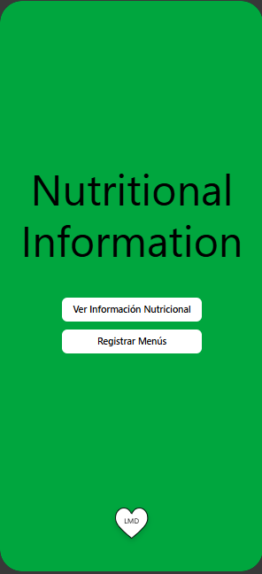
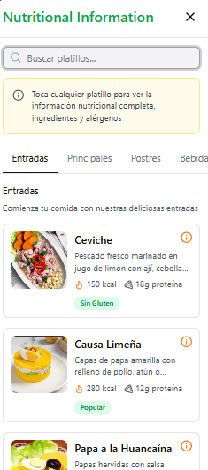
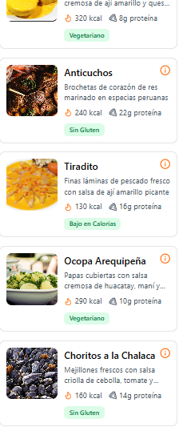
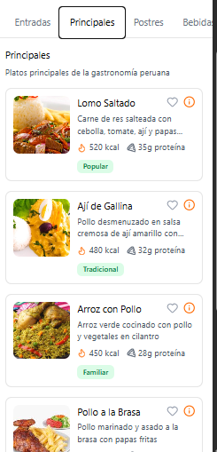
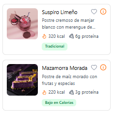
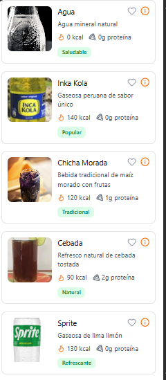

# BorradorProyectoM1
De LLonalith Maco
# Aplicación Informativa de Menú Nutricional

## Descripción del Proyecto
Una aplicación informativa de menú con información nutricional completa. La aplicación mostrará cada plato con sus calorías, proteínas, carbohidratos, grasas, etc.

## Exposición del Problema
Se tiene la problemática de no conocer la información nutricional de cada plato que consumimos. Esto es especialmente un inconveniente para personas que siguen dietas específicas. La aplicación traerá una información detallada para resolver este problema y facilitar la toma de decisiones alimenticias informadas.

## Plataforma
La aplicación será desarrollada utilizando **Android Studio**.

## Interfaz de Usuario e Interfaz de Administrador

### Pantalla de Inicio
En la pantalla de inicio se mostrarán los platos disponibles, con una foto y el nombre de cada uno de ellos. Los usuarios podrán explorar los menús disponibles y seleccionar el que deseen.

### Pantalla de Detalles
Al hacer clic en un plato, el usuario podrá ver los detalles, es decir, las propiedades o componentes del plato seleccionado, como su contenido nutricional, calorías, proteínas, etc.

### Búsqueda de Plato
Habrá una funcionalidad de búsqueda donde los usuarios podrán buscar el plato de su preferencia según el nombre o tipo de plato.

## Funcionalidad
- **Información nutricional**: La aplicación mostrará los datos nutricionales completos de cada plato (calorías, proteínas, grasas, carbohidratos, etc.).
- **Búsqueda de Menú**: Los usuarios podrán buscar platos específicos o explorar los menús disponibles.

## Diseño (Wireframes o Esquemas de Página)

.png>)
.png>)

Pantalla de inicio de app "ver informacion" "registrar menús"

Segunda pantalla "Entradas"

Tercera pantalla "Principales"

Cuarta pantalla "Postres"

Quinta pantalla "Bebidas"
